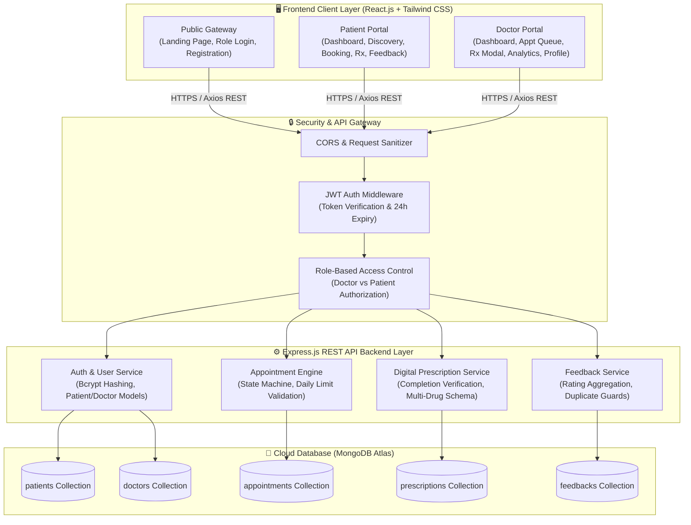
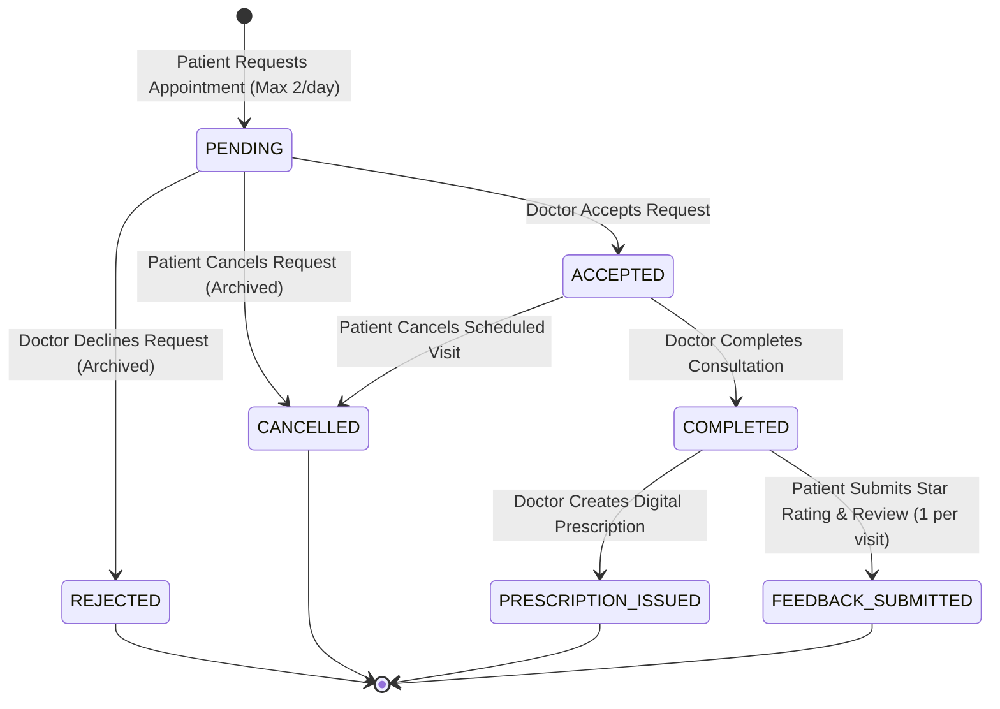
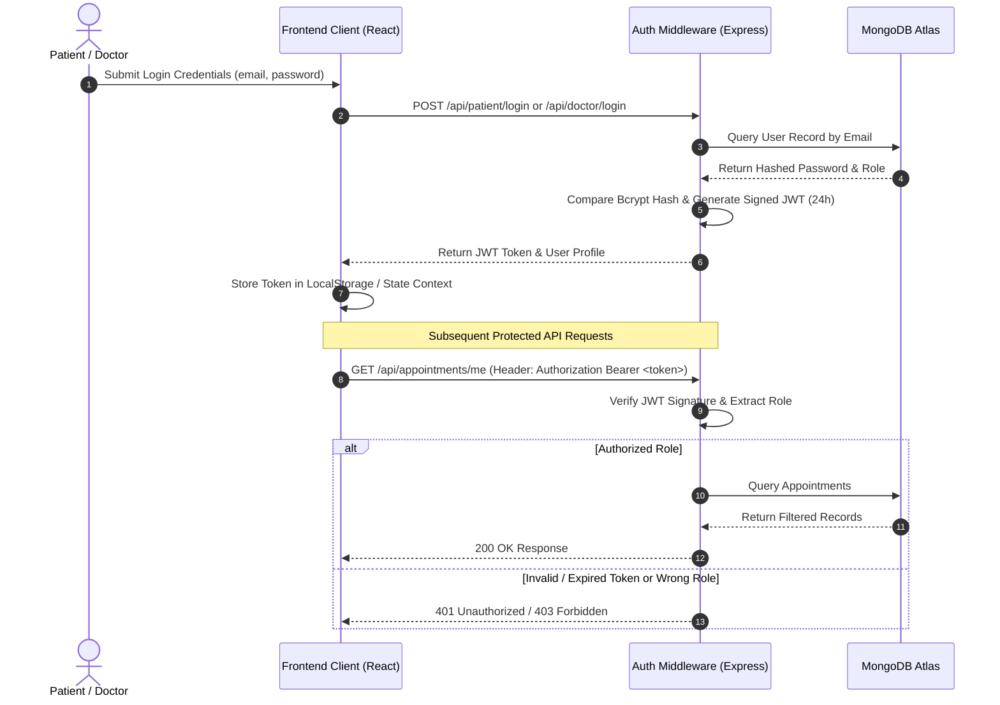

<div align="center">

# 🩺 MediTrack-Lite
### Enterprise-Grade Healthcare Appointment & Digital Prescription Management Platform

[](https://nodejs.org/)
[](https://expressjs.com/)
[](https://reactjs.org/)
[](https://www.mongodb.com/atlas)
[](https://tailwindcss.com/)
[](https://jwt.io/)
[]()
[]()

<p align="center">
  <b>A full-stack, realistic healthcare management platform bridging patients and healthcare providers.</b><br/>
  <i>Appointment Lifecycle • Multi-Drug Digital Prescriptions • Post-Consultation Reviews • Role-Based Access Control</i>
</p>

[Key Features](#-key-features) • [System Architecture](#-system-architecture) • [Appointment Lifecycle](#-appointment-lifecycle-state-machine) • [Folder Structure](#-production-folder-structure) • [API Reference](#-api-specification) • [Local Setup](#-local-development-setup) • [E2E Testing](#-automated-e2e-testing)

---

</div>

## 📌 1. Project Overview

**MediTrack-Lite** is designed to model realistic healthcare interactions beyond standard CRUD operations. The platform facilitates the complete consultation workflow:

* **Doctor Discovery & Credentials**: Patients explore verified doctors by specialty, viewing qualifications, years of experience, and clinical background.
* **Controlled Appointment Booking**: Automated business rule validation (strictly capping active bookings to **2 appointments per patient per calendar day**).
* **Deterministic Status Transitions**: Appointments transition through `PENDING` $\rightarrow$ `ACCEPTED` $\rightarrow$ `COMPLETED`, with soft-archiving on `REJECTED` or `CANCELLED`.
* **Digital Prescription Generation**: Multi-medicine prescription engine (dosage, frequency, duration, instructions, clinical remarks) locked to completed appointments.
* **Patient Feedback & Rating System**: Verified consultation reviews with duplicate prevention and live star rating aggregation for doctors.

---

## 🏛️ 2. System Architecture



---

## 🔄 3. Appointment Lifecycle State Machine



---

## 🔐 4. Authentication & Security Architecture



---

## ✨ 5. Key Features

### 🧑‍⚕️ Doctor Capabilities
- **Practice Dashboard**: Real-time summary cards for pending requests, in-progress visits, completed consultations, and live average rating ($★ / 5.0$).
- **Appointment Lifecycle Management**: Accept incoming requests, decline with reason, or mark active appointments as completed.
- **Digital Prescription Builder**: Multi-drug prescription builder specifying drug name, dosage, frequency, duration, instructions, and clinical advice.
- **Patient Reviews & Ratings**: View ratings (1–5 stars) and detailed comments submitted by patients after completed consultations.
- **Professional Profile Management**: Update medical qualifications, years of experience, contact phone, and practice biography.

### 👨‍⚕️ Patient Capabilities
- **Doctor Discovery**: Filter healthcare specialists by medical domain (Cardiology, Dermatology, Neurology, Pediatrics, etc.) with preview cards showing qualification and bio.
- **Appointment Booking Engine**: Schedule visits with date/time pickers and automatic enforcement of the **maximum 2 bookings per day** limit.
- **Status Tracking Tabs**: Interactive tab filters (`All`, `Pending Approval`, `Accepted / Scheduled`, `Completed`, `Cancelled / Declined`).
- **Digital Prescription Access**: Downloadable medical records and medication instructions available immediately after consultation completion.
- **Consultation Feedback**: Submit 1-to-5 star ratings and reviews for completed visits with duplicate review prevention.

---

## 📁 6. Production Folder Structure

```
clinic_projects/
├── backend/
│   ├── config/
│   │   └── db.js                 # MongoDB connection with custom DNS fallback
│   ├── controllers/
│   │   ├── appointmentController.js # Appointment booking, lifecycle, daily limits
│   │   ├── doctorController.js      # Doctor auth, discovery, profile management
│   │   ├── feedbackController.js    # Patient reviews & rating aggregations
│   │   ├── patientController.js     # Patient auth & profile management
│   │   └── prescriptionController.js# Digital prescription issuance & access
│   ├── middleware/
│   │   └── authMiddleware.js        # JWT token verification & role enforcement
│   ├── models/
│   │   ├── Appointment.js           # Appointment schema & status lifecycle
│   │   ├── Doctor.js                # Doctor credentials, specialty, qualification
│   │   ├── Feedback.js              # Reviews, star ratings, appointment reference
│   │   ├── Patient.js               # Patient details, contact, DOB, gender
│   │   └── Prescription.js          # Multi-drug prescriptions & instructions
│   ├── routes/
│   │   ├── appointmentRoutes.js     # /api/appointments endpoints
│   │   ├── doctorRoutes.js          # /api/doctor endpoints
│   │   ├── feedbackRoutes.js        # /api/feedbacks endpoints
│   │   ├── patientRoutes.js         # /api/patient endpoints
│   │   └── prescriptionRoutes.js    # /api/prescriptions endpoints
│   ├── .env                         # Backend environment configuration
│   ├── package.json                 # Backend dependencies & scripts
│   ├── server.js                    # Express application entry point
│   └── test_e2e.js                  # Complete automated E2E test suite (18 steps)
├── public/
│   ├── favicon.ico
│   ├── index.html                   # HTML template
│   └── manifest.json
├── src/
│   ├── components/
│   │   ├── Doctor/
│   │   │   ├── DoctorNavbar.js      # Doctor navigation header
│   │   │   └── PrescriptionModal.js # Prescription creation modal dialog
│   │   ├── Home/
│   │   │   ├── Features.js          # Homepage feature highlights
│   │   │   ├── Footer.js            # Footer component
│   │   │   ├── Hero.js              # Landing page hero banner
│   │   │   └── HomeNavbar.js        # Public navigation bar
│   │   ├── Patient/
│   │   │   ├── AppointmentCard.js   # Dynamic appointment status card
│   │   │   ├── PatientBackButton.js # Navigation back button
│   │   │   └── PatientNavbar.js     # Patient navigation header
│   │   └── BackButton.js            # Universal back button
│   ├── constants/
│   │   └── index.js                 # Specialties, status enums & limits
│   ├── context/
│   │   ├── AuthContext.js           # Authentication state context
│   │   ├── DoctorContext.js         # Doctor session context
│   │   └── PatientContext.js        # Patient session context
│   ├── pages/
│   │   ├── BookAppointment.js       # Doctor discovery & booking page
│   │   ├── DoctorAppointments.js    # Doctor consultation management
│   │   ├── DoctorDashboard.js       # Doctor practice analytics & metrics
│   │   ├── DoctorFeedback.js        # Doctor patient reviews page
│   │   ├── DoctorLogin.js           # Doctor authentication page
│   │   ├── DoctorPrescriptions.js   # Doctor prescription archive
│   │   ├── DoctorProfile.js         # Doctor professional profile editor
│   │   ├── DoctorRegister.js        # Doctor account registration
│   │   ├── Home.js                  # Public landing page
│   │   ├── PatientAppointments.js   # Patient appointment tracking tabs
│   │   ├── PatientDashboard.js      # Patient health portal & stats
│   │   ├── PatientFeedback.js       # Patient feedback history
│   │   ├── PatientLogin.js          # Patient authentication page
│   │   ├── PatientPrescriptions.js  # Patient digital prescriptions & review form
│   │   └── PatientRegister.js       # Patient account registration
│   ├── services/
│   │   ├── api.js                   # Centralized Axios client & JWT interceptors
│   │   ├── appointmentService.js    # Appointment queries & lifecycle API
│   │   ├── authService.js           # Authentication & profile API
│   │   ├── feedbackService.js       # Reviews & ratings API
│   │   └── prescriptionService.js   # Prescription generation & retrieval API
│   ├── App.css
│   ├── App.js                       # React Router configuration & route guards
│   ├── index.css                    # Tailwind CSS directives
│   └── index.js                     # React DOM entry point
├── .env                             # Frontend environment configuration
├── package.json                     # Frontend dependencies & scripts
├── tailwind.config.js               # Tailwind CSS theme configuration
└── README.md                        # Project documentation
```

---

## 📡 7. API Specification

### 🔑 Authentication & Profiles
| Method | Endpoint | Auth | Description |
| :--- | :--- | :--- | :--- |
| `POST` | `/api/patient/register` | Public | Register new patient account |
| `POST` | `/api/patient/login` | Public | Authenticate patient & receive JWT |
| `GET` | `/api/patient/me` | Patient | Get authenticated patient profile |
| `PUT` | `/api/patient/me` | Patient | Update patient profile details |
| `POST` | `/api/doctor/register` | Public | Register new doctor account |
| `POST` | `/api/doctor/login` | Public | Authenticate doctor & receive JWT |
| `GET` | `/api/doctor/me` | Doctor | Get authenticated doctor profile |
| `PUT` | `/api/doctor/profile` | Doctor | Update doctor qualification/experience/bio |
| `GET` | `/api/doctor/all` | Authenticated | List all active doctors for discovery |

### 📅 Appointments
| Method | Endpoint | Auth | Description |
| :--- | :--- | :--- | :--- |
| `GET` | `/api/appointments/specialties` | Authenticated | List all medical specialties |
| `GET` | `/api/appointments/doctors/:specialty` | Authenticated | List doctors by specialty |
| `POST` | `/api/appointments/book` | Patient | Book appointment (enforces 2/day limit) |
| `GET` | `/api/appointments/my` | Patient | Get patient's appointment history |
| `GET` | `/api/appointments/me` | Doctor | Get doctor's appointment queue |
| `GET` | `/api/appointments/count/:date` | Patient | Get active appointment count for a date |
| `PATCH` | `/api/appointments/accept/:id` | Doctor | Accept appointment (`PENDING` $\rightarrow$ `ACCEPTED`) |
| `PATCH` | `/api/appointments/complete/:id` | Doctor | Complete appointment (`ACCEPTED` $\rightarrow$ `COMPLETED`) |
| `DELETE` / `PATCH` | `/api/appointments/reject/:id` | Doctor | Reject appointment (`PENDING` $\rightarrow$ `REJECTED`) |
| `DELETE` / `PATCH` | `/api/appointments/cancel/:id` | Patient | Cancel appointment (`PENDING`/`ACCEPTED` $\rightarrow$ `CANCELLED`) |

### 💊 Digital Prescriptions
| Method | Endpoint | Auth | Description |
| :--- | :--- | :--- | :--- |
| `POST` | `/api/prescriptions` | Doctor | Issue prescription for `COMPLETED` appointment |
| `GET` | `/api/prescriptions/patient/me` | Patient | Fetch patient's digital prescriptions |
| `GET` | `/api/prescriptions/doctor/me` | Doctor | Fetch doctor's issued prescriptions |

### ⭐ Patient Feedback
| Method | Endpoint | Auth | Description |
| :--- | :--- | :--- | :--- |
| `POST` | `/api/feedbacks` | Patient | Submit rating (1–5) & review for completed visit |
| `GET` | `/api/feedbacks/patient/me` | Patient | Fetch patient's feedback history |
| `GET` | `/api/feedbacks/doctor/me` | Doctor | Fetch doctor's reviews & calculate average |

---

## 🚀 8. Local Development Setup

### 🔧 Prerequisites
- **Node.js**: v18.x or higher
- **npm**: v9.x or higher
- **MongoDB**: MongoDB Atlas URI or local instance (`mongodb://localhost:27017`)

---

### Step 1: Clone Repository
```bash
git clone https://github.com/your-username/meditrack-lite.git
cd clinic_projects
```

---

### Step 2: Configure Environment Variables

**Backend Configuration (`backend/.env`):**
```ini
PORT=5000
MONGO_URI=mongodb+srv://<username>:<password>@cluster.mongodb.net/clinic?appName=clinic
JWT_SECRET=your_super_secret_jwt_key_here
```

**Frontend Configuration (`.env` in root):**
```ini
REACT_APP_API_URL=http://localhost:5000
```

---

### Step 3: Install Dependencies

```bash
# Install root/frontend dependencies
npm install

# Install backend dependencies
cd backend
npm install
cd ..
```

---

### Step 4: Start the Servers

**Terminal 1 — Backend Server:**
```bash
node backend/server.js
# 🚀 Server running on http://localhost:5000
# ✅ Successfully connected to MongoDB
```

**Terminal 2 — Frontend Application:**
```bash
npm start
# 🌐 App running at http://localhost:3000
```

---

## 🧪 9. Automated E2E Testing

The project includes an end-to-end test suite (`backend/test_e2e.js`) validating all authentication flows, status transitions, daily limits, prescription issuance, and feedback controls.

To run the automated test suite:
```bash
node backend/test_e2e.js
```

### ✅ Test Suite Output
```text
==================================================
🏥 STARTING MEDITRACK-LITE FULL E2E WORKFLOW TESTS
==================================================
1️⃣ Registering test patient...                        ✅ Passed
2️⃣ Logging in patient...                              ✅ Passed
3️⃣ Registering test doctor...                         ✅ Passed
4️⃣ Logging in doctor...                               ✅ Passed
5️⃣ Testing Doctor Discovery APIs...                   ✅ Passed
6️⃣ Testing Doctor Profile Update & Get /me...          ✅ Passed
7️⃣ Testing Patient Profile Update & Get /me...         ✅ Passed
8️⃣ Booking Appointment #1 (Preferred Date = Tomorrow)  ✅ Passed (Status: pending)
9️⃣ Booking Appointment #2 (Same date, testing max 2)   ✅ Passed (Status: pending)
🔟 Booking Appointment #3 (Daily Limit Enforcement)    ✅ Correctly blocked with 400
1️⃣1️⃣ Doctor Accepting Appointment #1                   ✅ Passed (Status: accepted)
1️⃣2️⃣ Doctor Completing Appointment #1                  ✅ Passed (Status: completed)
1️⃣3️⃣ Doctor Creating Digital Prescription               ✅ Passed (Rx Created)
1️⃣4️⃣ Verifying Rx Access Control (Patient & Doctor)    ✅ Passed
1️⃣5️⃣ Patient Submitting Consultation Feedback          ✅ Passed (Rating 5/5)
1️⃣6️⃣ Duplicate Feedback Prevention                    ✅ Correctly blocked with 400
1️⃣7️⃣ Doctor Rejecting Appointment #2 (Soft Reject)     ✅ Passed (Status: rejected)
1️⃣8️⃣ Patient Cancelling Appointment #4 (Soft Cancel)   ✅ Passed (Status: cancelled)

==================================================
🎉 ALL E2E HEALTHCARE WORKFLOW TESTS PASSED 100%!
==================================================
```

---

## 🚢 10. Production Deployment

### 🔹 Backend Deployment (Render / Railway / AWS EC2)
1. Set the root directory or working directory to `backend/`.
2. **Build Command**: `npm install`
3. **Start Command**: `node server.js`
4. **Environment Variables**:
   - `PORT`: `5000`
   - `MONGO_URI`: `<Your MongoDB Atlas Connection String>`
   - `JWT_SECRET`: `<Secure Random 64-char Hex Secret>`

### 🔹 Frontend Deployment (Vercel / Netlify)
1. **Build Command**: `npm run build`
2. **Output Directory**: `build`
3. **Environment Variables**:
   - `REACT_APP_API_URL`: `<Your Deployed Backend URL, e.g. https://api.meditrack.com>`

---

## 📄 License
This project is licensed under the MIT License — feel free to use and adapt it for healthcare management workflows.
